# Django-React for weather history

This web app contains user registration and login using JSON Web Token while for services it is using an API call on Open Weather Map that retrieve data which is given to user to observe current weather parameters or past 24 hours. CRUD operations to endpoints were tested with Postman as below displayed; roadmap was assigned on Jira (Kanban process), then committed on new GitHub branch, reviewed and approved to merge main branch.

#

## Endpoints tested in POSTMAN

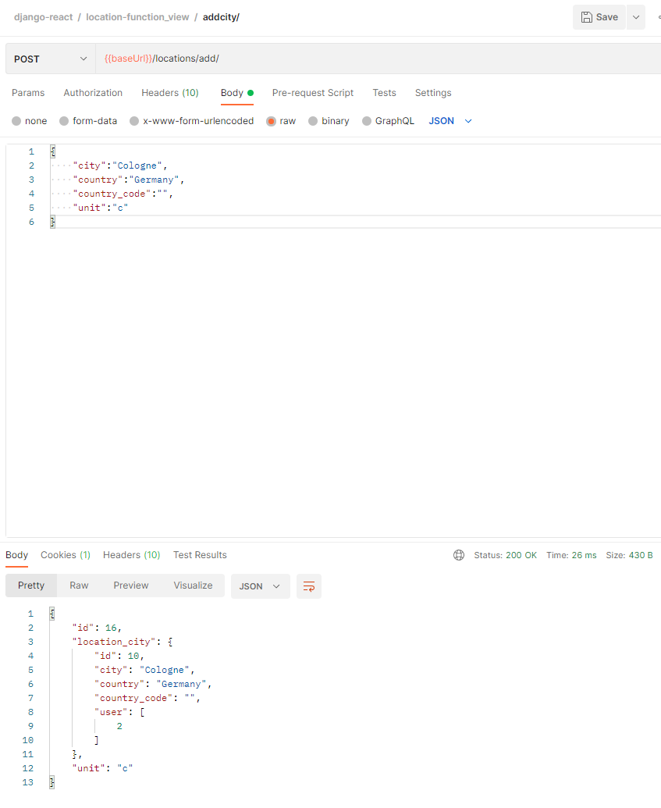

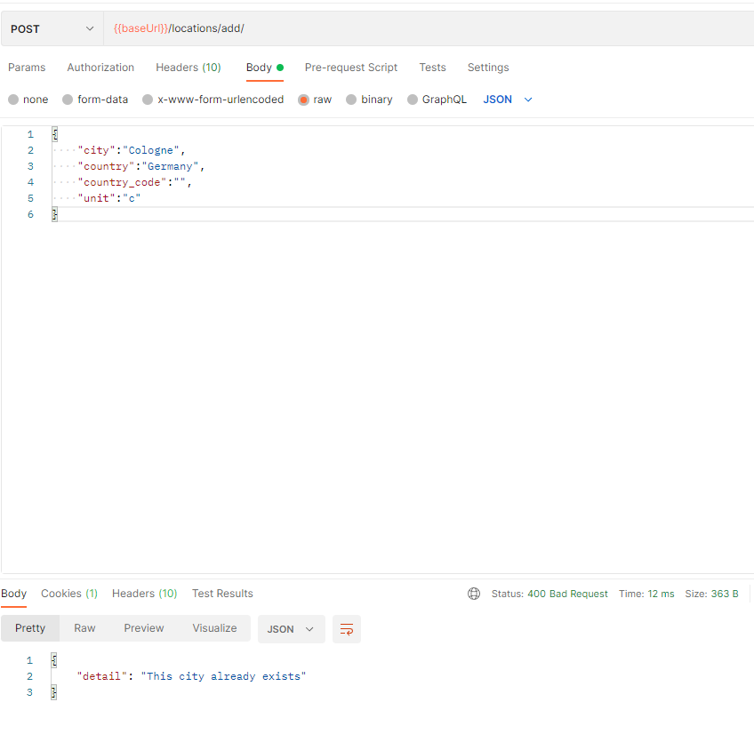

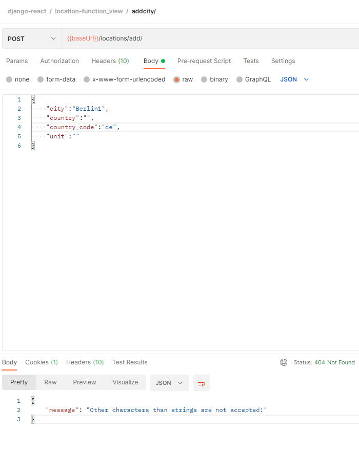

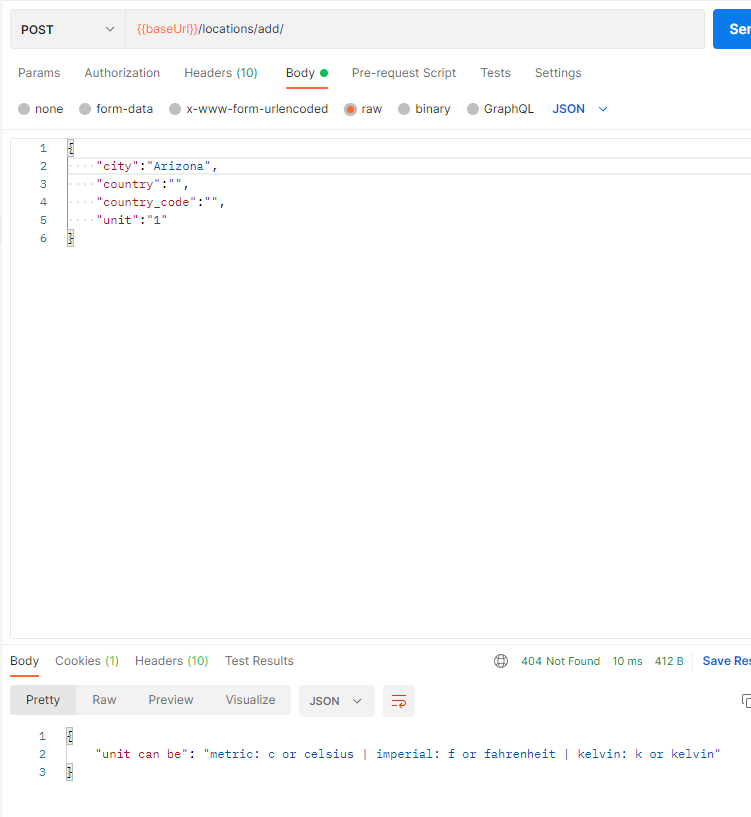

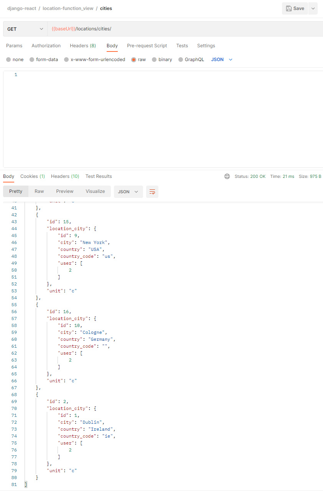

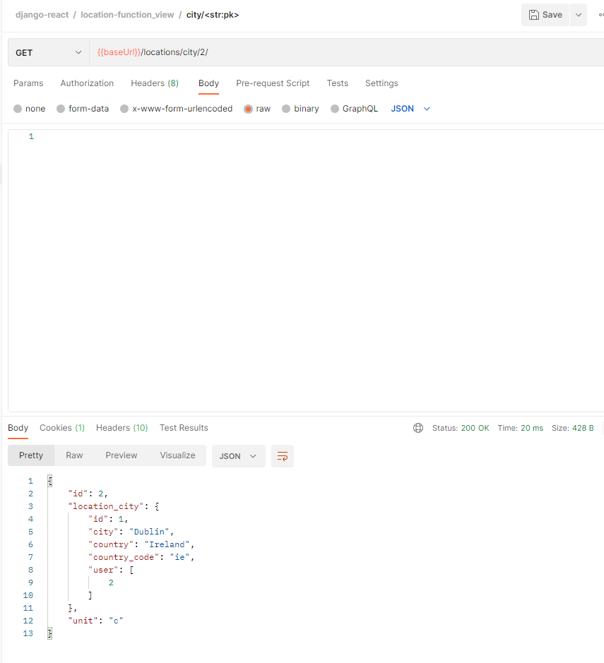

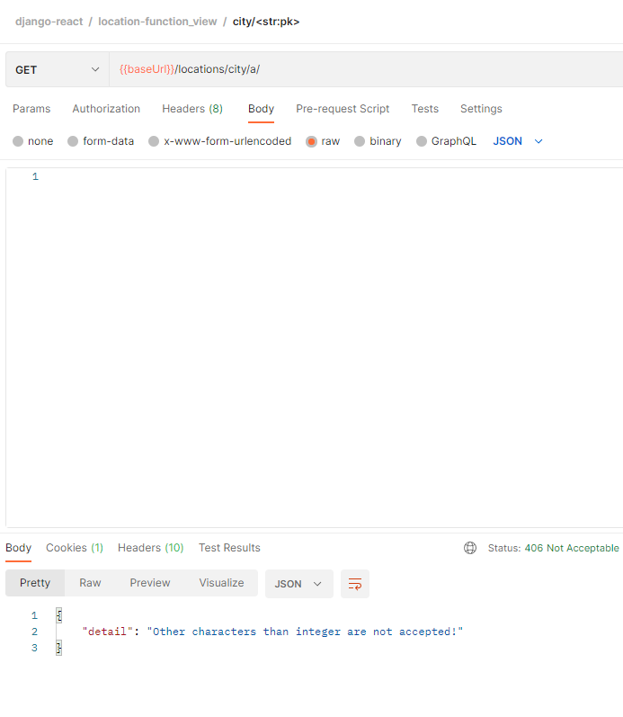

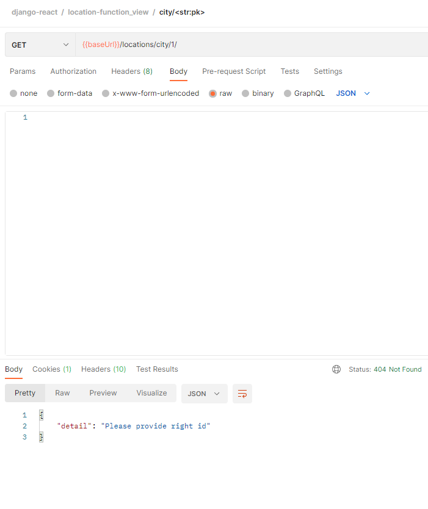

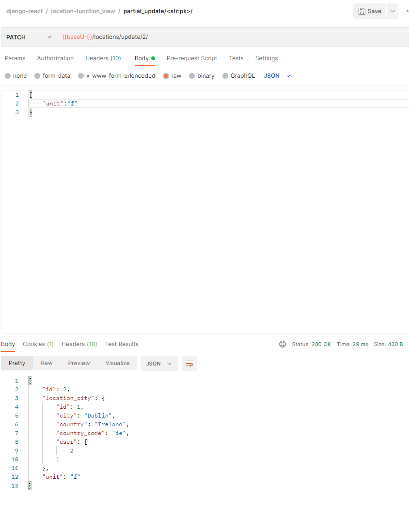

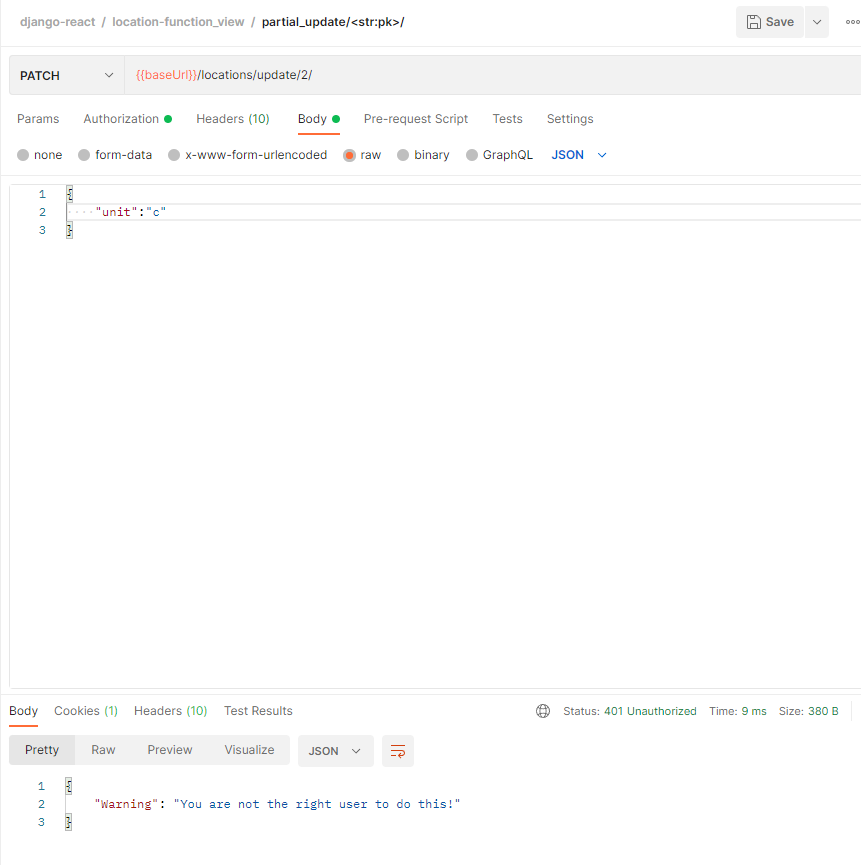

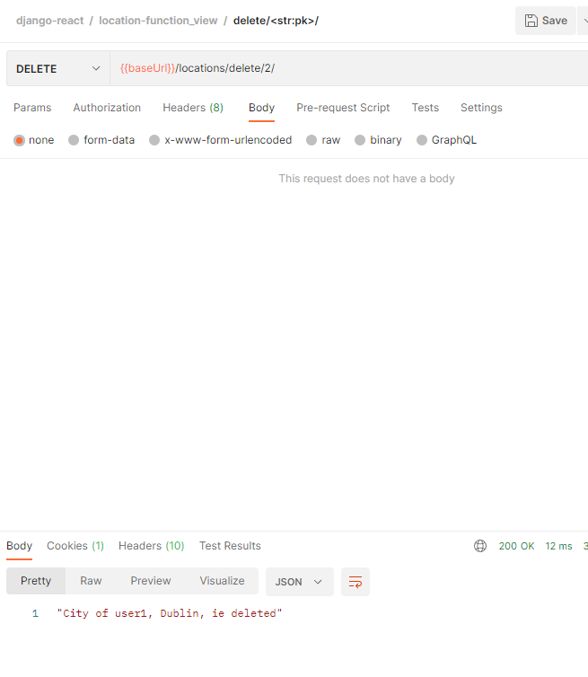

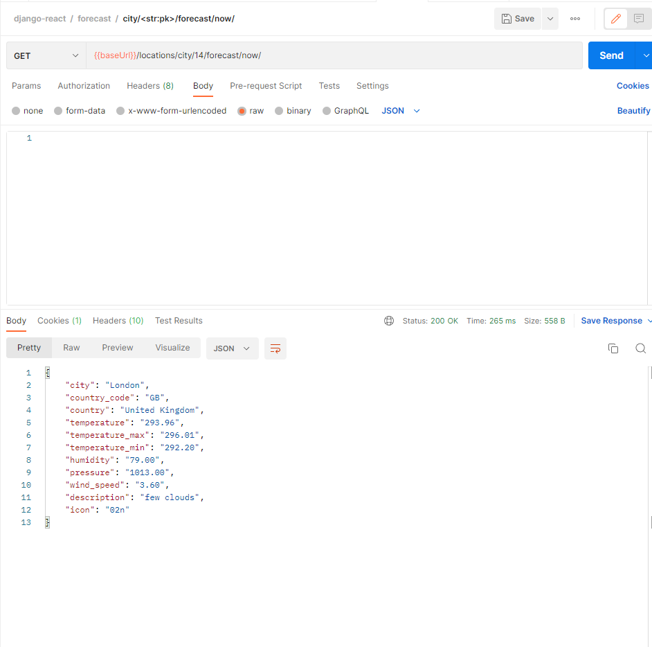
